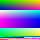
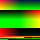

# Houdini bakes attributes to PNG files

## System requirement: 
Develop and tested on Houdini Indie 19.5

## For what?
I need a pipeline to bake P (positions) and Cd (colors) attributes to PNG files and then import them to three.js for websites use. This Houdini file can converts mash to particles and bakes the P to `p_16bit.png` and Cd to `color.png`

## Houdini screens preview

## Three.js app
I created this [threejs code](https://github.com/rc-bellergy/threejs-particles-from-png) that can decode the PNG files and convert the data to particles.

