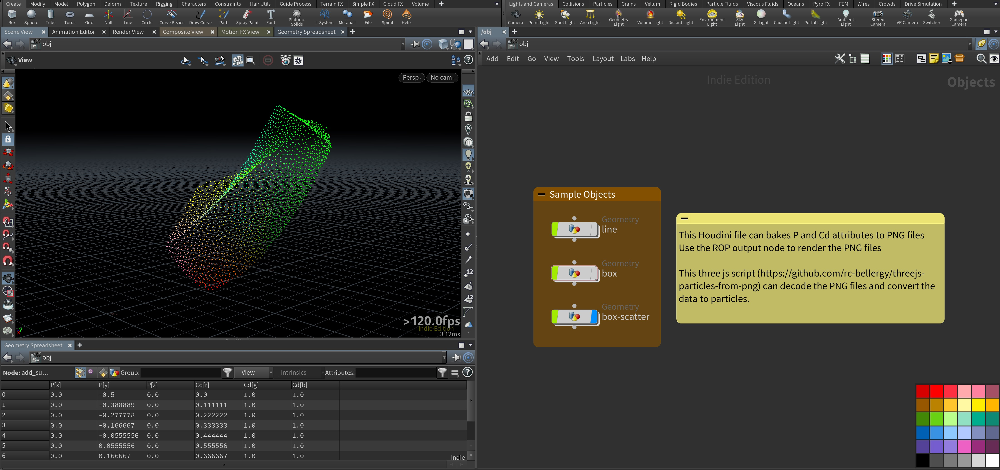
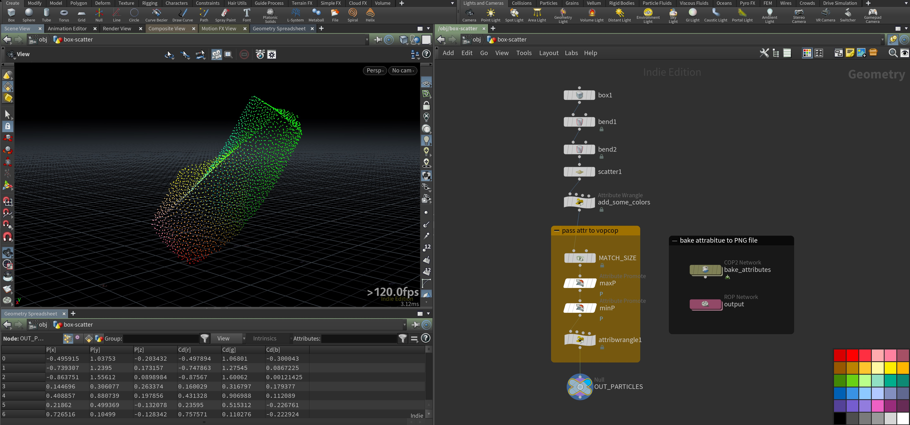
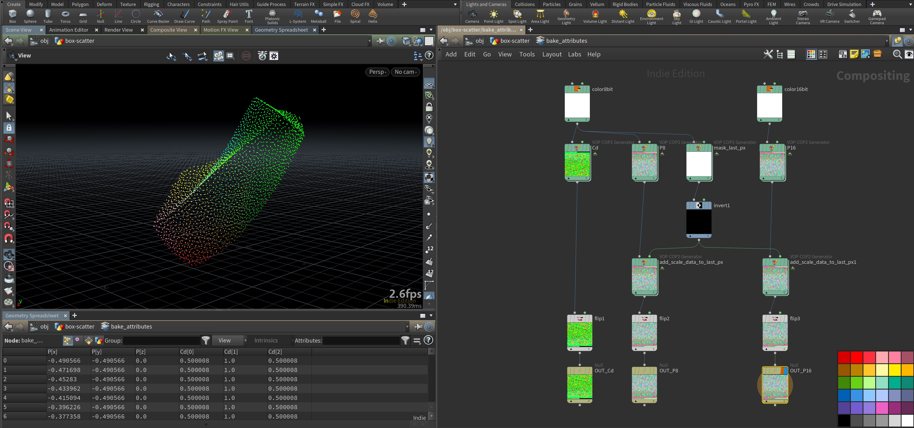
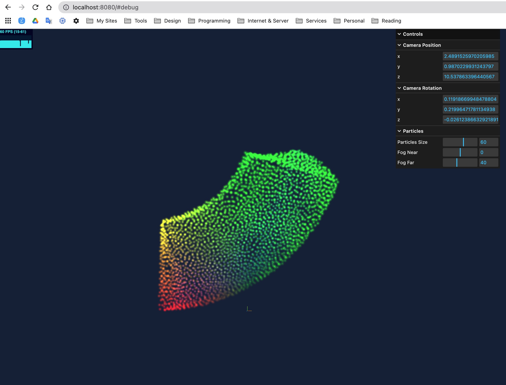

# Houdini bakes attributes to PNG files

It bakes P and Cd attributes to position.png and color.png

This [threejs code](https://github.com/rc-bellergy/threejs-particles-from-png) can decode the PNG files and convert the data to particles.

